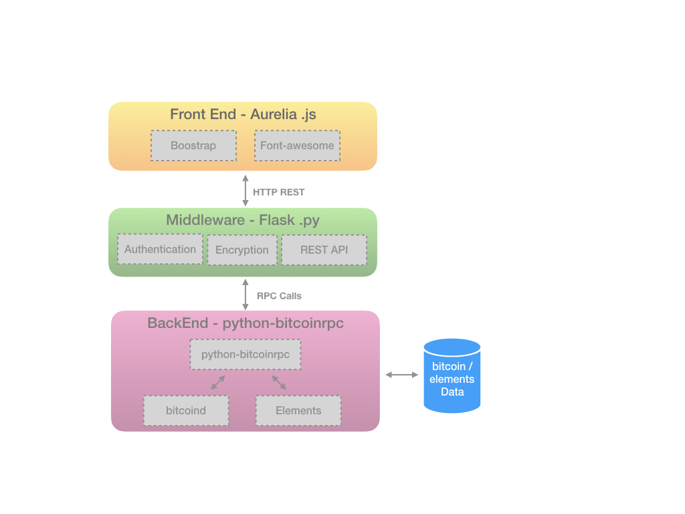

# Blockstream Elements Demo 

<!-- # Blockstream Elements demo & other use cases  -->
> Environment setup, worflow, scripts and other use cases prototypes (bitcon & elements deamons, web backend and front end)


[![Vagrant Version][vagrant-image]][vagrant-url] [![VirtualBox][virtualbox-image]][virtualbox-url]
[![Flask Version][flask-image]][flask-url]
[![Aurelia Version][aurelia-image]][aurelia-url]


Virtual machine using Vagrant to test Blockstream Elemens demo & aditional test use cases, python-bitcoinrpc, services layer on Flask (python web framework), front end using Auerlia (Js Framework)

## Architecture 



## Installation

### Vagrant Installation

Install Vagrant from  [Vagrant Website][vagrant-url]

Install VitualBox from [VirtualBox Website][virtualbox-url]


Open a terminal on you Mac:
```sh
# Initializes the current directory to be a Vagrant environment by creating an initial Vagrantfile if one doesn't already exist 
vagrant init

# Creates and configures guest machines according to your Vagrantfile
vagrant up
```
Clone this github repository (this will replace your Vagrantfile with the one you will need)

```sh
# Help on vagrant commands
vagrant -h


# connect via ssh to your virtual machine box
vagrant ssh
```

## Demo setup on bash 

We need to create some aliases for bitcoin and elements deamons

In the SSH session of your Vagrant virtual machine run:

```
source ./create_aliases.sh

source ./start_services.sh
```


When you want to stop the services do:
```
source ./stop_services.sh
```

## Flask installation

To use flask make sure you are on your ssh session of your Vagrant virtual machine

```
vagrant ssh
```

create virtual environment and install flask and python-bitcoinrpc

```
vagrant@vagrant-ubuntu-trusty-64:~$ python3 -m venv flasktest

(flasktest) vagrant@vagrant-ubuntu-trusty-64:~$ which pip
vagrant@vagrant-ubuntu-trusty-64:~$ /home/vagrant/flasktest/bin/pip

(flasktest) vagrant@vagrant-ubuntu-trusty-64:~$  pip install Flask
(flasktest) vagrant@vagrant-ubuntu-trusty-64:~$  pip install python-bitcoinrpc
```

activate virtual environment
```
vagrant@vagrant-ubuntu-trusty-64:~$ source flasktest/bin/activate

(flasktest) vagrant@vagrant-ubuntu-trusty-64:~$ which pip
vagrant@vagrant-ubuntu-trusty-64:~$ /home/vagrant/flasktest/bin/pip

(flasktest) vagrant@vagrant-ubuntu-trusty-64:~$  pip install Flask
(flasktest) vagrant@vagrant-ubuntu-trusty-64:~$  pip install python-bitcoinrpc
```


How to kill flask process running on backgroud

use `<ctrl> z` or `lsof -i tcp:5000`
`kill -9 <PID>` #where <PID> is the process id returned by lsof

A few motivating and useful examples of how your product can be used. Spice this up with code blocks and potentially more screenshots.

_For more examples and usage, please refer to the [Wiki][wiki]._

## Development setup

Describe how to install all development dependencies and how to run an automated test-suite of some kind. Potentially do this for multiple platforms.

## Release History

* 0.1.0
    * CHANGE: Update docs (module code remains unchanged)
* 0.2.0
    * CHANGE: Remove `setDefaultXYZ()`
    * ADD: Add `init()`

## Meta

Your Name – [@StartupsPal](https://twitter.com/dbader_org) – YourEmail@example.com

Distributed under the XYZ license. See ``LICENSE`` for more information.

[https://github.com/rserranon//ElementsBlockstream](https://github.com/rserranon)

## Contributing

1. Fork it (<https://github.com/yourname/yourproject/fork>)
2. Create your feature branch (`git checkout -b feature/fooBar`)
3. Commit your changes (`git commit -am 'Add some fooBar'`)
4. Push to the branch (`git push origin feature/fooBar`)
5. Create a new Pull Request

<!-- Markdown link & img dfn's -->
[vagrant-image]: https://img.shields.io/badge/2.2.3-vagrant-blue.svg 
[vagrant-url]:  https://www.vagrantup.com/
[virtualbox-image]: https://img.shields.io/badge/6.0-VirtualBox-blue.svg 
[virtualbox-url]:  https://www.virtualbox.org/
[aurelia-image]: https://img.shields.io/badge/1.3.1-Aurelia-blueviolet.svg
[aurelia-url]: https://aurelia.io
[flask-image]: https://img.shields.io/badge/1.0.2-Flask-green.svg 
[flask-url]: https://www.fullstackpython.com/flask.html
 

